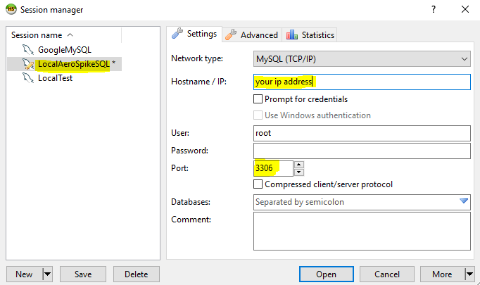
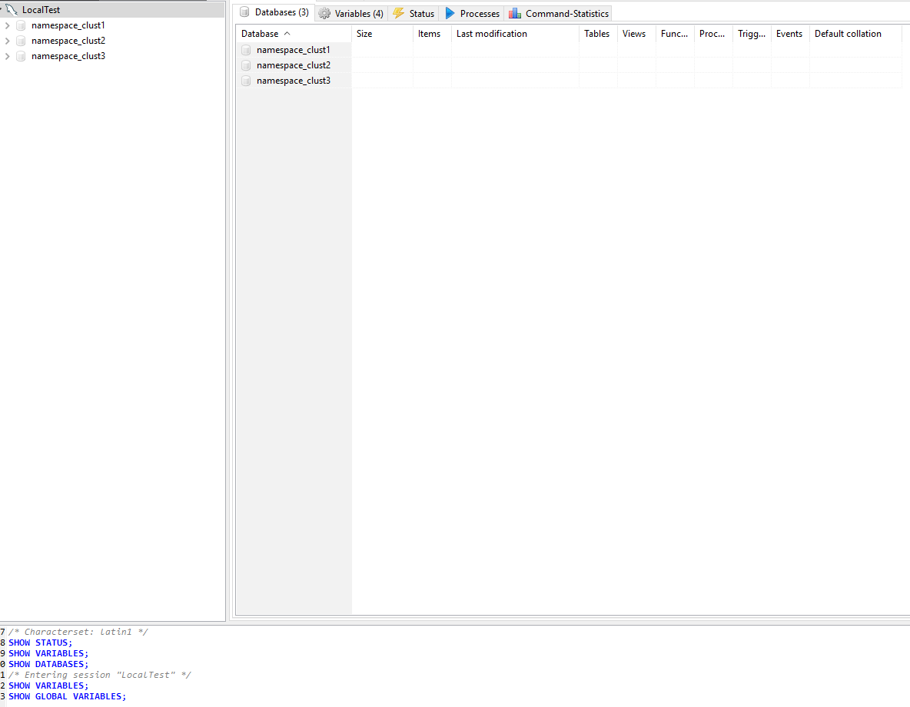
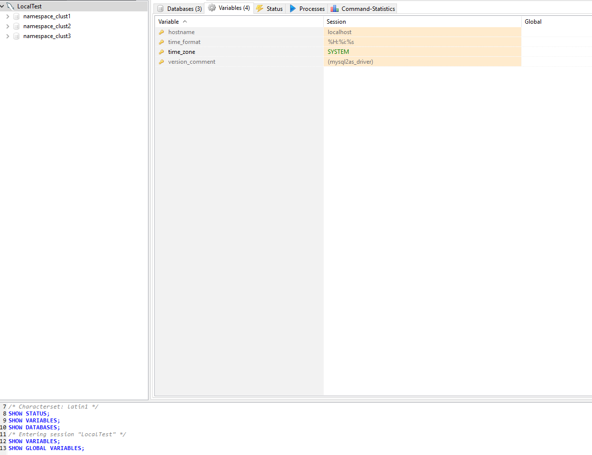
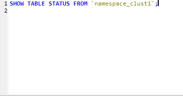
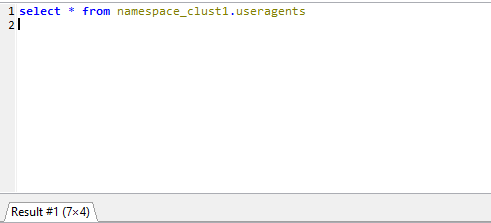

# AS_Mysql - Query AeroSpike from your favorite MySQL Client

This module implements the MySQL server protocol, so you will be able to Query AeroSpike from your favorite MySql-Client.

AS_Mysql was wrote as a single python file on purpose since :

- AeroSpike instalation already has python installed.
- DevOps will not be afraid to run it on production evenirmnets

Simple execution :

- just run : `nohup python36 ./as_mysql.py  >/dev/null 2>&1 &`

**Screenshots:**

*Connect:*

*Browse Namespaces:*

*Browse Variables:*

*Show Table Status (Table fields and details):*

* 'Select' from AeroSpike :*

Misc:

- Some of the code is ported version of : https://github.com/CloudQuote/faux-mysql-server/blob/master/src/index.js
- Windows Debugging: `/cygdrive/c/Program\ Files\ \(x86\)/Python36-32/python.exe -u as_mysql.py`
