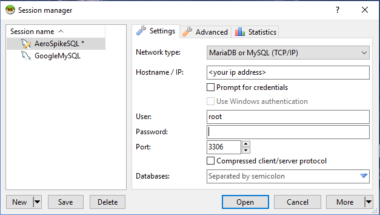
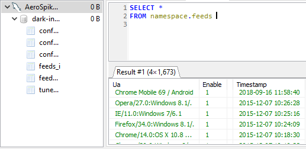

# AS_Mysql - Query AeroSpike from your favorite MySQL Client

This module implements the MySQL server protocol, so you will be able to query AeroSpike from your favorite MySql-Client.

AS_Mysql was intentionally written as a single python file, due to the following reasons:

- AeroSpike already has python installed.
- Running the program on production environments will be straightforward (for DevOps).

**Simple execution :**

- just run : `nohup python36 ./as_mysql.py  >/dev/null 2>&1 &` , on one of your AeroSpike nodes.

**Screenshots:**

*Connect:*

* Show namespaces / Show sets / Select Query :*

**Contributors:**

- Zac Sadan
- Dmitri Krasnenko
- ?

**Misc:**

- Some of the code is ported version of : https://github.com/CloudQuote/faux-mysql-server/blob/master/src/index.js
- Windows Debugging: `/cygdrive/c/Program\ Files\ \(x86\)/Python36-32/python.exe -u as_mysql.py`
